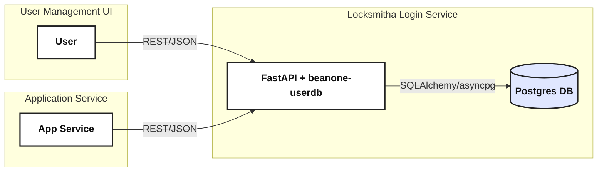

# Locksmitha

<p align="center">
  
</p>

[](https://github.com/beanone/locksmitha/releases)
[](https://github.com/beanone/locksmitha/blob/main/LICENSE)
[](https://github.com/beanone/locksmitha/actions?query=workflow%3Atests)
[](https://codecov.io/gh/beanone/locksmitha)
[](https://github.com/astral-sh/ruff)
[](https://github.com/beanone/locksmitha/actions/workflows/docker-publish.yml)

---

## Table of Contents

- [Overview & Architecture](#overview--architecture)
- [Requirements](#requirements)
- [Project Structure](#project-structure)
- [Setup & Usage](#setup--usage)
- [Environment Variables](#environment-variables)
- [Setting Up the User Database and Admin User Account](#setting-up-the-user-database-and-admin-user-account)
- [Docker Configuration](#docker-configuration)
- [API Endpoints](#api-endpoints)
- [API Documentation](#api-documentation)
- [Postman Collection](#postman-collection)
- [Health Checks](#health-checks)
- [Logging](#logging)
- [Security Features](#security-features)
- [Development](#development)
- [CI/CD](#cicd)
- [License](#license)
- [Manual Password Reset](#manual-password-reset)

---

## Overview & Architecture

Locksmitha implements a secure, extensible authentication and user management service using FastAPI, SQLAlchemy, and [userdb](https://github.com/beanone/userdb). It is designed to be the authentication backend for modern web applications and microservices.

**Key features:**
- JWT-based authentication
- User registration, login, and profile endpoints
- Password reset and email verification (if enabled)
- Security-compliant logging and rate limiting
- **RBAC (Role-Based Access Control) is not yet implemented, but is planned for a future release.**
- Dockerized and CI/CD ready

### Architecture Diagram


---

## Requirements

- **Python:** 3.12 (tested). Lower versions (>=3.10) may work but are not guaranteed.
- **Build:** Uses [hatchling](https://hatch.pypa.io/) for packaging.
- **Development dependencies:** Install with `pip install -r requirements-test.txt`.

---

## Project Structure

```
locksmitha/
├── src/locksmitha/
│   ├── main.py
│   ├── config.py
│   ├── auth.py
│   └── ...
├── tests/
├── Dockerfile
├── docker-compose.yml
├── docker-compose.dev.yml
├── pyproject.toml
├── requirements.txt
├── requirements-test.txt
├── .pre-commit-config.yaml
├── .dockerignore
├── .gitignore
├── .coveragerc
└── README.md
```

---

## Setup & Usage

### Using Docker (Recommended)

1. **Create a `.env` file**:
   ```bash
   cp env.sample .env
   # Edit .env with your configuration
   ```

2. **Run with Docker Compose**:
   ```bash
   # For production
   docker-compose up --build --no-cache

   # For development (with live reload)
   docker-compose -f docker-compose.dev.yml build --no-cache
   docker-compose -f docker-compose.dev.yml up
   ```

The service will be available at `http://localhost:8001`.

### Manual Setup

1. **Create and activate a virtual environment**:
   ```bash
   python -m venv .venv
   source .venv/bin/activate
   ```

2. **Install dependencies**:
   ```bash
   pip install -r requirements.txt
   ```

3. **Configure environment variables**:
   ```bash
   cp env.sample .env
   # Edit .env with your configuration
   ```

4. **Run the service**:
   ```bash
   uvicorn src.locksmitha.main:app --reload
   ```

## Environment Variables

Create a `.env` file with the following variables:

```env
# Authentication Secrets
JWT_SECRET=your_jwt_secret
RESET_PASSWORD_SECRET=your_reset_secret
VERIFICATION_SECRET=your_verification_secret

# Database Configuration
POSTGRES_USER=postgres
POSTGRES_PASSWORD=your_password
POSTGRES_DB=userdb
DATABASE_URL=postgresql+asyncpg://${POSTGRES_USER}:${POSTGRES_PASSWORD}@db:5432/${POSTGRES_DB}

# CORS Settings
ALLOWED_ORIGINS=["http://localhost:8001", "http://127.0.0.1:8001"]

# Optional Settings
LOG_LEVEL=INFO
```

## Setting Up the User Database and Admin User Account

> **Adapted from [userdb README](https://github.com/beanone/userdb#setting-up-the-user-database) and [Admin User Account Setup](https://github.com/beanone/userdb#admin-user-account-setup).**

Before running Locksmitha, you need to ensure the user table exists in your database.

**Automatic Table Creation:**
- Locksmitha will automatically create the user table at startup if it does not exist. This is convenient for development, CI, and first-run scenarios.

**Production Best Practice:**
- For production and team environments, it is still recommended to use Alembic migrations to manage database schema changes and ensure consistency.
- Example Alembic setup:
  ```bash
  alembic revision --autogenerate -m "create user table"
  alembic upgrade head
  ```
  Make sure your Alembic `env.py` includes the userdb model's metadata:
  ```python
  from userdb.models import Base
  target_metadata = Base.metadata
  ```

**Programmatic Table Creation (for local/dev):**
  ```python
  from userdb.models import Base
  from sqlalchemy import create_engine

  engine = create_engine("sqlite:///./test.db")  # Or your DB URL
  Base.metadata.create_all(engine)
  ```

> **Note:** For production, always use migrations to avoid data loss and ensure schema consistency.

---

### Admin User Account Setup

- After the user table is created (by Locksmitha, Alembic, or programmatically), Locksmitha will automatically create an admin (superuser) account if one does not already exist.
- **Default admin credentials:**
  - Email: `admin@example.com`
  - Password: `changeme`
  - Full name: `Admin`
- **Override defaults in production:** Set the following environment variables before starting your app to change the admin account credentials:
  - `ADMIN_EMAIL` (default: `admin@example.com`)
  - `ADMIN_PASSWORD` (default: `changeme`)
  - `ADMIN_FULL_NAME` (default: `Admin`)
- > **Security Note:** Always override the default admin password and email in production environments!
- The admin user is created only if no superuser exists in the database. If you delete the admin user, it will be recreated on the next app startup unless another superuser exists.

## Docker Configuration

> **Note:**
> - The production configuration (`docker-compose.yml`) uses a pre-built image and is intended for stable deployments.
> - The development configuration (`docker-compose.dev.yml`) builds the image locally, enables live reload with Uvicorn, and mounts your local `./src` directory into the container for instant code changes.
> - All other settings (database, resource limits, logging, health checks, network) are the same in both files.

> **Tip:** Use the development configuration for local development and testing, and the production configuration for deployments.

> **Also:** To avoid stale library issues, always use `docker-compose build --no-cache` (or the equivalent dev command) after updating dependencies.

### Production

The production setup uses:
- Published Docker image
- Health checks for both app and database
- Resource limits for stability
- Log rotation
- Isolated network
- Persistent database volume

```bash
docker-compose up
```

### Development

The development setup includes:
- Local source code mounting for live reload
- Development-specific uvicorn settings
- Same health checks and resource limits as production
- Persistent database volume

```bash
docker-compose -f docker-compose.dev.yml --build --no-cache
docker-compose -f docker-compose.dev.yml up
```

### Resource Limits

- **Application Container**:
  - CPU: 0.5 cores max, 0.25 cores reserved
  - Memory: 512MB max, 256MB reserved

- **Database Container**:
  - CPU: 1.0 cores max, 0.5 cores reserved
  - Memory: 1GB max, 512MB reserved

### Advanced Deployment

For advanced deployment scenarios, see [docs/deployment_examples.md](docs/deployment_examples.md) for:
- Using different databases (Postgres, SQLite)
- Environment variable management
- Running multiple services
- Best practices for production and development

---

## API Endpoints

| Endpoint                  | Method | Auth Required | Description                              |
|--------------------------|--------|--------------|------------------------------------------|
| `/auth/jwt/login`        | POST   | No           | User login (returns JWT; **requires `application/x-www-form-urlencoded` with `username` and `password` fields**) |
| `/auth/register`         | POST   | No           | User registration                        |
| `/users/me`              | GET    | Yes          | Get current user info                    |
| `/users/`                | GET    | Yes (admin)  | List users (**admin only; user must have `is_superuser: true`**) |
| `/auth/forgot-password`  | POST   | No           | Request password reset (**if enabled**)  |
| `/auth/reset-password`   | POST   | No           | Reset password (**if enabled**)          |
| `/auth/verify`           | POST   | No           | Email verification (**if enabled**)      |
| `/health`                | GET    | No           | Health check endpoint                    |


## API Documentation

- **Interactive API docs** are available at [`/docs`](http://localhost:8001/docs) (Swagger UI) and [`/redoc`](http://localhost:8001/redoc) when the service is running.
- **Typical flow:**
  1. Register or log in to obtain a JWT.
  3. Explore and test endpoints directly in the Swagger UI.

## Postman Collection

A ready-to-use Postman collection is provided for testing and exploring the Locksmitha API.

- **Location:** `tests/postman/locksmitha.postman_collection.json`
- **Endpoints covered:**
  - Health check (`/health`)
  - Register user (`/auth/register`)
  - Login user (`/auth/jwt/login`)
  - Get current user info (`/users/me`)

### How to Use

1. **Import the Collection:**
   - Open Postman.
   - Click `Import` and select `tests/postman/locksmitha.postman_collection.json`.

2. **Set the `base_url` Variable:**
   - The collection uses a `base_url` variable (default: `http://localhost:8001`).
   - To test against a different host/port, edit the `base_url` variable in the collection or your Postman environment.

3. **Run Requests in Order:**
   - Start with `Health Check` to verify the service is running.
   - Use `Register User` to create a new user (edit the email/password as needed).
   - Use `Login User` to authenticate. The collection will automatically save the `access_token` to an environment variable.
   - Use `Get Current User` to fetch user info (requires the `access_token`).
   - **API Key Management:**
     - Use `Create API Key` to generate a new API key (requires authentication).
     - Use `List API Keys` to view all API keys for the user (requires authentication).
     - Use `Delete API Key` to revoke an API key by ID (requires authentication; uses the `api_key_id` variable set by previous requests).

4. **Tips:**
   - The `access_token` is set automatically after login and used for authenticated requests.
   - The `api_key_id` is set automatically after creating or listing API keys and used for deletion.
   - You can duplicate and modify requests to test other endpoints or users.

5. **Example: Testing Against a Different Host**
   - If your API is running at `http://127.0.0.1:9000`, set `base_url` to that value in Postman before running the requests.

This collection is a quick way to verify your deployment and experiment with the API interactively.

## Health Checks

The service includes health checks for both the application and database:

- **Application Health Check**:
  - Endpoint: `/health`
  - Interval: 30s
  - Timeout: 10s
  - Retries: 3
  - Start Period: 40s

- **Database Health Check**:
  - Command: `pg_isready`
  - Interval: 10s
  - Timeout: 5s
  - Retries: 5

## Logging

Logs are configured with rotation:
- Maximum size: 10MB
- Maximum files: 3
- Format: JSON

## Security Features

- Non-root user in container
- Resource limits to prevent DoS
- Health checks for reliability
- Isolated network
- Environment variable based configuration
- JWT-based authentication
- Password hashing with Argon2

## Development

### Test Structure & Running Tests

- **Unit tests:** Located in `tests/unit/`. Run with:
  ```bash
  pytest tests/unit
  ```
- **Integration tests:** Located in `tests/integration/`. Run with:
  ```bash
  pytest tests/integration
  ```

- **Test requirements:**
  - Create and activate a virtual environment
  - Install with `pip install -r requirements-test.txt`

### Coverage

- Run with:
  ```bash
  pytest --cov=src/locksmitha --cov-report=term-missing --cov-report=html
  ```
- Coverage reports are output to the terminal and as HTML.

### Linting & Formatting

- **Ruff linter:**
  ```bash
  ruff check .
  ```
- **Auto-fix with Ruff:**
  ```bash
  ruff check . --fix
  ```
- **Run formatter:**
  ```
  ruff format .
  ```
- **Pre-commit hooks:**
  ```bash
  pre-commit run --all-files
  ```
  Fix any errors before pushing code.

## CI/CD

Locksmitha uses GitHub Actions for continuous integration and deployment:

### Workflows

1. **Tests** (`tests.yml`):
   - Runs unit and integration tests
   - Collects and uploads coverage reports
   - Triggers on push to main and pull requests

2. **Docker Publish** (`docker-publish.yml`):
   - Builds and publishes Docker images
   - Includes security scanning
   - Triggers on push to main

### Quality Gates

- All tests must pass
- Code coverage must meet minimum thresholds
- Security scans must pass
- Code must pass linting checks

## License

This project is licensed under the MIT License. See the [LICENSE](https://github.com/beanone/locksmitha/blob/main/LICENSE) file for more details.

## Manual Password Reset

If you need to manually test the password reset functionality or perform a password reset without a dedicated frontend application, please refer to the following guide:

- **[Manual Password Reset Guide (Using Curl)](./MANUAL_PASSWORD_RESET.md)**
