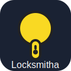
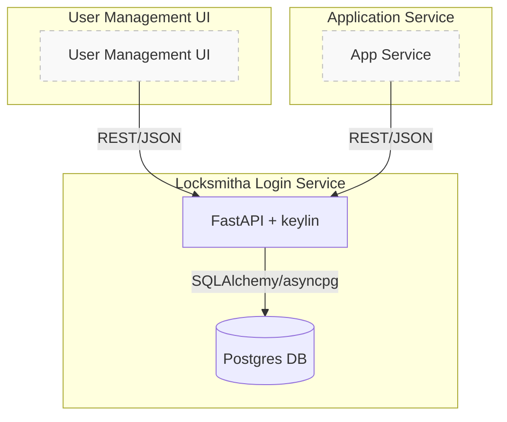

<table>
<tr>
<td></td>
<td><h1 style="margin-left: 10px;">Locksmitha Login Service</h1></td>
</tr>
</table>

[](https://github.com/beanone/locksmitha/blob/main/LICENSE)
[](https://github.com/beanone/locksmitha/actions?query=workflow%3Atests)
[](https://codecov.io/gh/beanone/locksmitha)
[](https://github.com/astral-sh/ruff)
[](https://github.com/beanone/locksmitha/actions/workflows/docker-publish.yml)

A production-ready FastAPI login/authentication service for the beanone organization. **This project is a direct sequel to the [keylin](https://github.com/beanone/keylin/blob/main/README.md) library, providing a full-featured login API and user management backend.**

---

## Overview & Architecture

Locksmitha implements a secure, extensible authentication and user management service using FastAPI, SQLAlchemy, and [keylin](https://github.com/beanone/keylin). It is designed to be the authentication backend for modern web applications and microservices.

**Key features:**
- JWT-based authentication
- User registration, login, and profile endpoints
- Password reset and email verification (if enabled)
- Security-compliant logging and rate limiting
- Ready for RBAC/permission extension
- Dockerized and CI/CD ready

### Architecture Diagram


---

## Endpoints & Behavior

| Endpoint                | Method | Auth Required | Description                        |
|------------------------|--------|--------------|------------------------------------|
| `/auth/jwt/login`      | POST   | No           | User login (returns JWT)           |
| `/auth/register`       | POST   | No           | User registration                  |
| `/users/me`            | GET    | Yes          | Get current user info              |
| `/users/`              | GET    | Yes (admin)  | List users (admin only)            |
| `/auth/forgot-password`| POST   | No           | Request password reset (if enabled)|
| `/auth/reset-password` | POST   | No           | Reset password (if enabled)        |
| `/auth/verify`         | POST   | No           | Email verification (if enabled)    |
| `/health`              | GET    | No           | Health check endpoint              |

- **Registration and login are open to all.**
- **User info and user listing require authentication (and admin for listing).**
- **Password reset and verification are optional, depending on config.**

See [API_UI_INTEGRATION_GUIDE.md](./API_UI_INTEGRATION_GUIDE.md) for request/response examples and integration details.

---

## Project Structure

```
locksmitha/
├── src/locksmitha/
│   ├── main.py
│   ├── config.py
│   ├── auth.py
│   └── ...
├── tests/
├── Dockerfile
├── docker-compose.yml
├── pyproject.toml
├── requirements-test.txt
├── .pre-commit-config.yaml
├── .dockerignore
├── .gitignore
├── .coveragerc
└── README.md
```

---

## Setup & Usage

1. **Create and activate a virtual environment:**
    ```bash
    python -m venv .venv
    source .venv/bin/activate
    ```
2. **Install dependencies:**
    ```bash
    pip install hatch
    hatch build
    pip install dist/*.whl
    pip install -r requirements-test.txt
    ```
3. **Configure environment variables:**
    - Create a `.env` file in the project root with the following variables:
      ```env
      KEYLIN_JWT_SECRET=supersecretjwtkey
      KEYLIN_DATABASE_URL=postgresql+asyncpg://postgres:password@db:5432/keylindb
      KEYLIN_RESET_PASSWORD_SECRET=supersecretresetkey
      KEYLIN_VERIFICATION_SECRET=supersecretverifykey
      ALLOWED_ORIGINS=http://localhost,http://127.0.0.1
      ```

4. **Run the service:**
    ```bash
    docker-compose up --build
    # or
    uvicorn src.locksmitha.main:app --reload
    ```

5. **Testing:**
    ```bash
    pytest
    ```

6. **Linting:**
    ```bash
    pre-commit run --all-files
    ```

---

## CI/CD
- GitHub Actions for linting, testing, and Docker publishing are configured in `.github/workflows/`.

---

## License

MIT License
