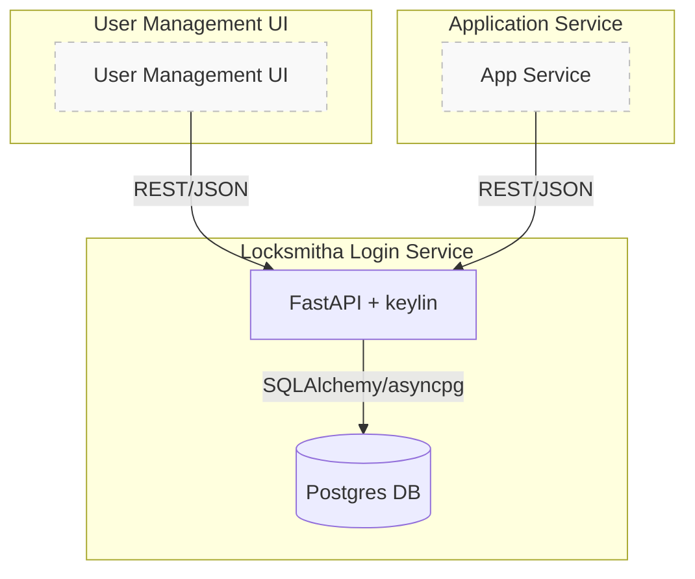

# Locksmitha

<p align="center">
  
</p>

[](https://github.com/beanone/locksmitha/blob/main/LICENSE)
[](https://github.com/beanone/locksmitha/actions?query=workflow%3Atests)
[](https://codecov.io/gh/beanone/locksmitha)
[](https://github.com/astral-sh/ruff)
[](https://github.com/beanone/locksmitha/actions/workflows/docker-publish.yml)

---

## Table of Contents

- [Overview & Architecture](#overview--architecture)
- [Project Structure](#project-structure)
- [Setup & Usage](#setup--usage)
- [Environment Variables](#environment-variables)
- [Docker Configuration](#docker-configuration)
- [API Endpoints](#api-endpoints)
- [Health Checks](#health-checks)
- [Logging](#logging)
- [Security Features](#security-features)
- [Development](#development)
- [CI/CD](#cicd)
- [License](#license)

---

## Overview & Architecture

Locksmitha implements a secure, extensible authentication and user management service using FastAPI, SQLAlchemy, and [keylin](https://github.com/beanone/keylin). It is designed to be the authentication backend for modern web applications and microservices.

**Key features:**
- JWT-based authentication
- User registration, login, and profile endpoints
- Password reset and email verification (if enabled)
- Security-compliant logging and rate limiting
- Ready for RBAC/permission extension
- Dockerized and CI/CD ready

### Architecture Diagram


---

## Project Structure

```
locksmitha/
├── src/locksmitha/
│   ├── main.py
│   ├── config.py
│   ├── auth.py
│   └── ...
├── tests/
├── Dockerfile
├── docker-compose.yml
├── docker-compose.dev.yml
├── pyproject.toml
├── requirements.txt
├── requirements-test.txt
├── .pre-commit-config.yaml
├── .dockerignore
├── .gitignore
├── .coveragerc
└── README.md
```

---

## Setup & Usage

### Using Docker (Recommended)

1. **Create a `.env` file**:
   ```bash
   cp env.sample .env
   # Edit .env with your configuration
   ```

2. **Run with Docker Compose**:
   ```bash
   # For production
   docker-compose up

   # For development (with live reload)
   docker-compose -f docker-compose.dev.yml up --build
   ```

The service will be available at `http://localhost:8001`.

### Manual Setup

1. **Create and activate a virtual environment**:
   ```bash
   python -m venv .venv
   source .venv/bin/activate
   ```

2. **Install dependencies**:
   ```bash
   pip install -r requirements.txt
   ```

3. **Configure environment variables**:
   ```bash
   cp env.sample .env
   # Edit .env with your configuration
   ```

4. **Run the service**:
   ```bash
   uvicorn src.locksmitha.main:app --reload
   ```

## Environment Variables

Create a `.env` file with the following variables:

```env
# Authentication Secrets
JWT_SECRET=your_jwt_secret
RESET_PASSWORD_SECRET=your_reset_secret
VERIFICATION_SECRET=your_verification_secret

# Database Configuration
POSTGRES_USER=postgres
POSTGRES_PASSWORD=your_password
POSTGRES_DB=keylindb
DATABASE_URL=postgresql+asyncpg://${POSTGRES_USER}:${POSTGRES_PASSWORD}@db:5432/${POSTGRES_DB}

# CORS Settings
ALLOWED_ORIGINS=["http://localhost:8001", "http://127.0.0.1:8001"]

# Optional Settings
# LOG_LEVEL=INFO
```

## Docker Configuration

### Production

The production setup uses:
- Published Docker image
- Health checks for both app and database
- Resource limits for stability
- Log rotation
- Isolated network
- Persistent database volume

```bash
docker-compose up
```

### Development

The development setup includes:
- Local source code mounting for live reload
- Development-specific uvicorn settings
- Same health checks and resource limits as production
- Persistent database volume

```bash
docker-compose -f docker-compose.dev.yml up --build
```

### Resource Limits

- **Application Container**:
  - CPU: 0.5 cores max, 0.25 cores reserved
  - Memory: 512MB max, 256MB reserved

- **Database Container**:
  - CPU: 1.0 cores max, 0.5 cores reserved
  - Memory: 1GB max, 512MB reserved

## API Endpoints

| Endpoint                | Method | Auth Required | Description                        |
|------------------------|--------|--------------|------------------------------------|
| `/auth/jwt/login`      | POST   | No           | User login (returns JWT)           |
| `/auth/register`       | POST   | No           | User registration                  |
| `/users/me`            | GET    | Yes          | Get current user info              |
| `/users/`              | GET    | Yes (admin)  | List users (admin only)            |
| `/auth/forgot-password`| POST   | No           | Request password reset (if enabled)|
| `/auth/reset-password` | POST   | No           | Reset password (if enabled)        |
| `/auth/verify`         | POST   | No           | Email verification (if enabled)    |
| `/health`              | GET    | No           | Health check endpoint              |

## Health Checks

The service includes health checks for both the application and database:

- **Application Health Check**:
  - Endpoint: `/health`
  - Interval: 30s
  - Timeout: 10s
  - Retries: 3
  - Start Period: 40s

- **Database Health Check**:
  - Command: `pg_isready`
  - Interval: 10s
  - Timeout: 5s
  - Retries: 5

## Logging

Logs are configured with rotation:
- Maximum size: 10MB
- Maximum files: 3
- Format: JSON

## Security Features

- Non-root user in container
- Resource limits to prevent DoS
- Health checks for reliability
- Isolated network
- Environment variable based configuration
- JWT-based authentication
- Password hashing with Argon2

## Development

### Running Tests

```bash
# Run all tests
pytest

# Run specific test categories
pytest tests/unit
pytest tests/integration
```

### Code Quality

```bash
# Run linter
ruff check .

# Run formatter
ruff format .
```

## CI/CD

Locksmitha uses GitHub Actions for continuous integration and deployment:

### Workflows

1. **Tests** (`tests.yml`):
   - Runs unit and integration tests
   - Collects and uploads coverage reports
   - Triggers on push to main and pull requests

2. **Docker Publish** (`docker-publish.yml`):
   - Builds and publishes Docker images
   - Includes security scanning
   - Triggers on push to main

### Quality Gates

- All tests must pass
- Code coverage must meet minimum thresholds
- Security scans must pass
- Code must pass linting checks

## License

This project is licensed under the MIT License. See the [LICENSE](https://github.com/beanone/locksmitha/blob/main/LICENSE) file for more details.
